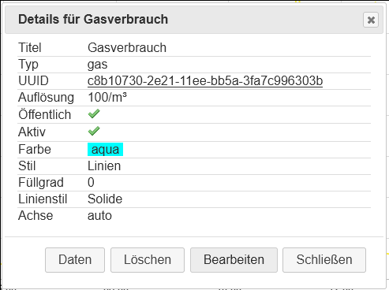
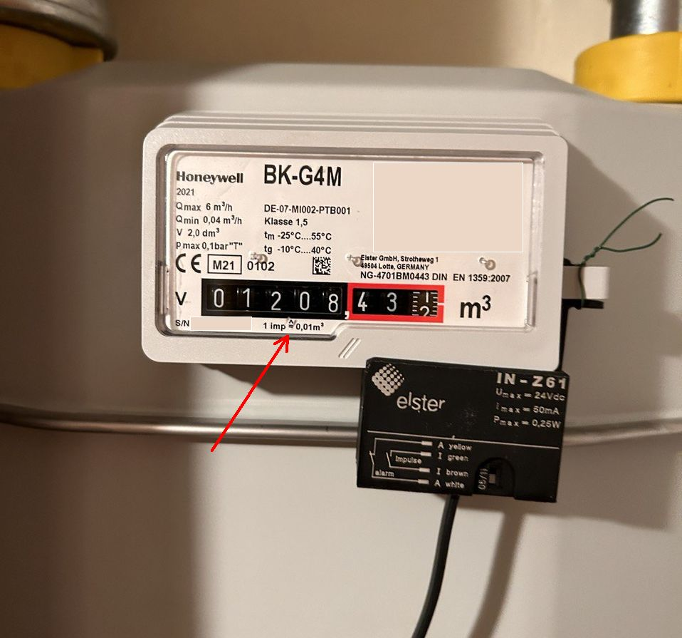
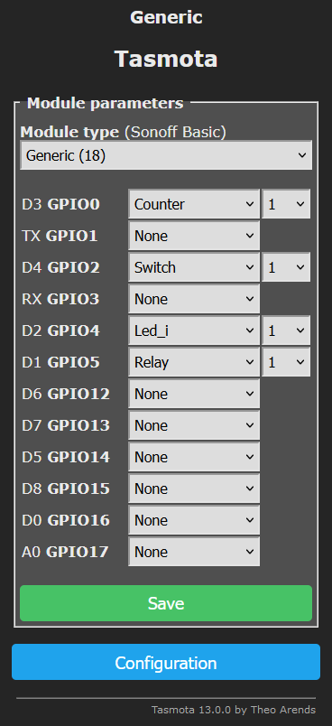

# Tasmota-basierter Gaszähler-Logger für Volkszähler
Das Project beschreibt die Implementierung eines Geräts zur Übertragung der momentanen Verbrauchswerte sowie des Zählerstandes eines Gaz-Zählers an die [Volkszähler](https://wiki.volkszaehler.org/start)-Middleware

## Prinzip
- Einer der Zahlenräder des Gaszählers beisitz einen Magnet
- Bei voller Umdrehung des Zahlenrades wird der [Reedshalter](https://de.wikipedia.org/wiki/Reedschalter) ein Mal geschlossen
- Beim Schließen wird ein [GPIO](https://www.wemos.cc/en/latest/d1/d1_mini_lite.html#pin) des [ESP8266](https://en.wikipedia.org/wiki/ESP8266)-Chips auf 0 gesetzt
- Die [Tasmota](https://tasmota.github.io/docs/About/)-Software reagiert auf den geänderten Zustand des GPIO und sendet einen Inkrement über das (WiFi)-Netzwerk and die [REST-API](https://wiki.volkszaehler.org/development/api/reference) des [Volkszähler-Servers](https://wiki.volkszaehler.org/software/middleware)
- Zusätzlich inkrementiert Tasmota den eigenen internen Gas-Zähler und schickt seinen Wert ebenfalls and den Server
- Der Volkszähler-Server speichert die übertragenen Werte
- Die Werte können über das [Volkszähler-Frontend](https://wiki.volkszaehler.org/software/frontends/frontend) auf verschiedene Art-und-Weise präsentiert oder ausgewertet werden.

## Hardware

Mein Sender nutzt [Wemos D1](https://www.wemos.cc/en/latest/d1/d1_mini_lite.html) als Platform. Es würde aber mit jedem anderen ESP8266- bzw ESP32-basierten Board funktionieren.

Das Auslesen der momentanen Verbrauchwerte erfolgt über einen [Reedshalter](https://de.wikipedia.org/wiki/Reedschalter). Die Voraussetzung ist, dass der Gaszähler einen magnetischen Signalgeber besitzt.

Ich habe mich für den für meinen Gaszähler originalen [IN-Z61](https://process.honeywell.com/us/en/site/elster-instromet-de/produkte/gasmessung/balgengaszahler/in-z61) entschieden.

### Schaltplan

#### Erklärung zum Schaltplan

##### S1 "IN-Z61"
die einzige nicht-optionale Komponente (außer ESP8266) auf diesem Schaltplan. Beim Schließen wird das [D4/GPIO2](https://www.wemos.cc/en/latest/d1/d1_mini_lite.html#pin) Kontakt des Chips auf 0 gesetzt. Der Kontakt D4 besitzt einen internen [Pull-up Resistor](https://en.wikipedia.org/wiki/Pull-up_resistor), somit muss man keinen eigenen einlöten. 

Der Kontakt D4 hat noch eine andere Besonderheit: an ihm ist das Platinen-interne LED angeschlossen. Schliesst man den S1, so leuchtet das LED rein elektronisch (i.e. ohne jegliche Software), was die Suche nach Fehlern erleichtert.

##### C1, C2
Diese beide Kondensatoren sollen die Laufzeit-Stabilität erhöhen. Der kleine filtert hochfrequente Störungen, der Große - die niedrigfrequente Schwankungen.

Die beiden sollen am besten direkt zwischen 3V3 und G(ND) eingelötet werden.

##### Rot-/Grün-LED's
Das grüne LED signalisiert die Verbindung mit dem WiFi (durchgehendes Leuchten).
Das Rote leuchtet kurz auf bei jedem Auslösen des Reedschalters (programmiert).

##### Stromversorgung
Es reicht ein Handelsüblicher USB-Ladegerät mit einem Micro-USB-Anschluss.

### Volkszähler-Einstellung

#### Volkszähler-Installation
Als Erstes muss die [Volkszähler-Software](https://volkszaehler.org/) selbst [installiert](https://wiki.volkszaehler.org/howto/getstarted) werden. Meine läuft auf einem Raspberry Pi 3.
Theoretisch kann für den Anfang die Demo-Installation auf der [Homepage](https://volkszaehler.org/) verwendet werden.

#### Kanäle einrichten
Für das Projekt werden 2 Kanäle benötigt:
1. für momentane Verbrauchwerte
2. für den Zählerstand

Die Konfiguration wie auf den Bildern:

Die Auflösung ist normalerweise auf dem Zähler angegeben:

0.01 -> 100

### Tasmota-Einstellungen

#### Vorbereitung
Die Tasmota installation is ausführlich im Netz [beschrieben](https://tasmota.github.io/docs/Getting-Started/).
Ich habe die [Web-Installation](https://tasmota.github.io/install/) verwendet.
Vor der Tasmota-Installation müssen noch entsprechende [Windows-Treiber](https://www.wemos.cc/en/latest/ch340_driver.html) für die Übertragung installiert werden.
Nach der erfolgreichen Tasmota-Installation muss diese noch in dem Heim-WiFi-Netzwerk eingeloggt werden. Dafür wird mit einem Smartphone zunächst direct ins Tasmota-WiFi-Netzwerk eingeloggt. Dann konfiguriert man Tasmota für die Verbindung mit dem Heim-WiFi und anschließen verbindet man sich mit Tasmota über das Heim-WiFi. 

#### Konfiguration der GPIO's
Zuerst das Modul-Typ ausgewählt und gespeichert wird, was zu einem Neustart von Tasmota führt.

Anschließend werden die GPIO's wie auf dem Bild eingestellt:

##### D4/Switch/1
Diese GPIO wird elektronisch geschaltet und registriert das Schließen des Reed-Kontaktes.
##### D3/Counter/1
Diese GPIO wird nur programmatisch geschaltet. Tasmota bietet leider keine Möglichkeit eines rein virtuellen Counters. Es gibt zwar Variables, diese "überleben" aber den Neustart nicht.Deswegen muss man eine GPIO dafür "missbrauchen"
##### D2/Led_i/1 
Diese GPIO wird and das grüne LED angeschlossen und von Tasmota automatisch mit dem Status der WiFi-Verbindung versorgt. Blink - keine WiFi. Durchgehen - die WiFi-Verbindung besteht.

##### D1/Relay/1
Diese GPIO wird and das rote LED angeschlossen und programmatisch für kurze Zeit bei jedem Schließen des Reed-Kontaktes eingeschaltet.

#### Programmierung der Logik
Die Programmierung der Logik erfolgt über die Eingabe der [Tasmota-Commands](https://tasmota.github.io/docs/Commands/) in der Tasmota-Web-Console:

##### Command 1
`Backlog SetOption114 1; SwitchMode 2; SwitchDebounce 50;`

##### Command 2
`Rule1 ON Switch1#State=1 DO Backlog WebSend [192.168.178.77:8080] /data/c8b10730-2e21-11ee-bb5a-3fa7c996303b.json?operation=add; Counter1 +1; Power1 1; Delay 20; Power1 0 ENDON ON Counter1#Data DO WebSend [192.168.178.77:8080] /data/99dc1b00-2e21-11ee-9221-c31d5b1d4b10.json?operation=add&value=%value% ENDON`

Die `Rule1` wird beim Schließen des Reed-Schalters aktiviert und macht folgendes:
1. Senden eines Verbrauchsignals (d.h. 0.01 m2) and den Verbrauchskanal
2. Inkrementieren des internen Zählerstands
3. Schalten des roten LED für 20 sek
4. Schicken des internen Zählerstands and den Zählerstand-Kanal

Damit dir Regel funktioniert müssen folgende Bestandteile durch Ihre Werte ersetzt werden:

|Wert| zu ersetzen durch|
|----|------------------|
|192.168.178.77| die IP-Adresse der Volkszählers im Ihrem Netz|
|c8b10730-2e21-11ee-bb5a-3fa7c996303b| den UUID des von Ihnen erstellten Verbrauchskanals |
|99dc1b00-2e21-11ee-9221-c31d5b1d4b10| den UUID des von Ihnen erstellten Zählerstand-Kanals |

##### Command 3
`Rule1 1`

Aktiviert die `Rule1`

##### Command 4
`Counter1 120843`

Setzt den initialen Wert internen Zählers auf den Wert vom Gaszähler. Dabei soll die ermittelte Auflösung des Zähler-Magnetes berücksichtigt werden. 

In meinem Fall: 
| | |
|---|----|
| Zählerstand | 1208,435 |
| Auflösung | 0,01 |
| Zu setzende Wert des internen Tasmota-Zählers| 120843|
